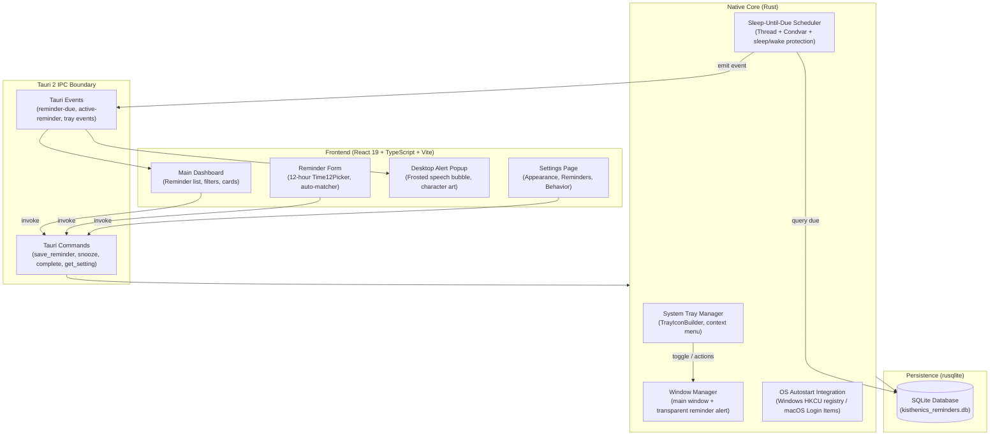

# System Architecture

Kisthenics Desktop Companion is designed as a hybrid desktop utility combining a modern reactive web frontend with a high-performance native Rust core and a local-first SQLite database.



---

## 1. Dual-Window Desktop Architecture

The application defines two independent Tauri WebView windows in `src-tauri/tauri.conf.json`:

1. **`main` Window** (`width: 960, height: 720`):
   - Standard decorated desktop window with title bar and min/max controls.
   - Hosts the primary dashboard, reminder creation/editing modal, character roster, and dedicated settings page.
   - Closing the window defaults to hiding it to the system tray (`closeToTray: true`), allowing background scheduling to remain uninterrupted.
2. **`reminder` Window** (`width: 460, height: 540`):
   - Frameless, transparent (`transparent: true`), undecorated (`decorations: false`), non-taskbar (`skipTaskbar: true`), always-on-top (`alwaysOnTop: true`).
   - Hidden by default. Shows dynamically only when a reminder is alerted.
   - Automatically positioned at the bottom-right of the active display with multi-monitor DPI scaling and taskbar padding.

---

## 2. Multi-Monitor Display Positioning

When a reminder triggers, Rust calculates the target window coordinates in `show_reminder_window` (`src-tauri/src/lib.rs`):
- Retrieves the active monitor or primary monitor.
- Applies the display's DPI `scale_factor` to ensure pixel-perfect rendering across standard, 2K, and 4K displays.
- Computes `(x, y)` relative to screen bounds minus configurable margins (`marginRight`, `marginBottom`) and OS taskbar compensation:
  ```rust
  let x = (m_pos.x + m_size.width as i32 - win_width - mr).max(m_pos.x + (16.0 * scale_factor) as i32);
  let y = (m_pos.y + m_size.height as i32 - win_height - mb - taskbar_padding).max(m_pos.y + (16.0 * scale_factor) as i32);
  ```

---

## 3. Background Scheduler Engine

Unlike naive desktop timers that poll the database on fixed short intervals, Kisthenics Companion utilizes a **Sleep-Until-Due Condvar Scheduler**:

1. **Immediate Execution**: Processes any overdue or currently due reminders.
2. **Next-Due Timestamp Query**: Finds the minimum `COALESCE(snooze_until, trigger_timestamp)` among pending items.
3. **Adaptive Sleep Timeout**: Calculates duration until the next event, clamped between `500ms` and `10,000ms`.
   - The upper bound (10s) guarantees instant recovery from OS sleep/wake cycles or system clock changes.
   - When a user adds, edits, or deletes a reminder, Rust triggers `notifier.notify()`, which wakes the thread immediately without waiting for the timeout.

---

## 4. SQLite Schema & Migration System

Local database state resides in the user's OS application directory (`kisthenics_reminders.db`):
- Managed via `rusqlite` with `PRAGMA quick_check(1)` auto-repair on startup.
- Uses `PRAGMA user_version` for forward-compatible schema upgrades.

### Schema: `reminders`
| Column | Type | Description |
| :--- | :--- | :--- |
| `id` | `TEXT PRIMARY KEY` | Unique reminder UUID |
| `title` | `TEXT NOT NULL` | Title / Task summary |
| `message` | `TEXT NOT NULL` | Notes displayed in speech bubble |
| `time` | `TEXT NOT NULL` | Internal 24-hour machine time (`HH:mm`) |
| `date` | `TEXT NOT NULL` | Target date (`YYYY-MM-DD`) |
| `trigger_timestamp` | `INTEGER NOT NULL` | Unix millisecond epoch timestamp |
| `character_id` | `TEXT NOT NULL` | Selected or `'auto'` character identifier |
| `resolved_character_id` | `TEXT` | Specific character ID matched by auto engine |
| `recurrence` | `TEXT NOT NULL` | `'once'`, `'daily'`, `'weekly'`, `'weekdays'` |
| `priority` | `TEXT NOT NULL` | `'low'`, `'medium'`, `'high'`, `'urgent'` |
| `status` | `TEXT NOT NULL` | `'pending'`, `'alerted'`, `'completed'` |
| `snooze_until` | `INTEGER` | Unix epoch millisecond snooze target |
| `snooze_count` | `INTEGER NOT NULL` | Number of times snoozed |
| `created_at` | `INTEGER NOT NULL` | Millisecond creation timestamp |
| `completed_at` | `INTEGER` | Millisecond completion timestamp |
| `category` | `TEXT` | Categorization tag (`Work`, `Fitness`, etc.) |
| `sound_type` | `TEXT` | Audio cue identifier |
| `duration_seconds` | `INTEGER` | Auto-dismiss duration (0 = persistent) |

### Schema: `settings`
Key-value store (`key TEXT PRIMARY KEY, value TEXT NOT NULL`) persisting serialized JSON configurations.

---

## 5. System Tray & Window Lifecycle

- **Tray Integration**: Managed via `TrayIconBuilder` with menu items:
  - *Open Kisthenics Companion*
  - *New Reminder*
  - *Today's Reminders*
  - *Settings*
  - *Quit* (invokes `app.exit(0)`)
- **Close Behavior**: Closing the main window checks `closeToTray` in settings. If enabled, it suppresses window destruction and hides the window to run silently in the background tray.
