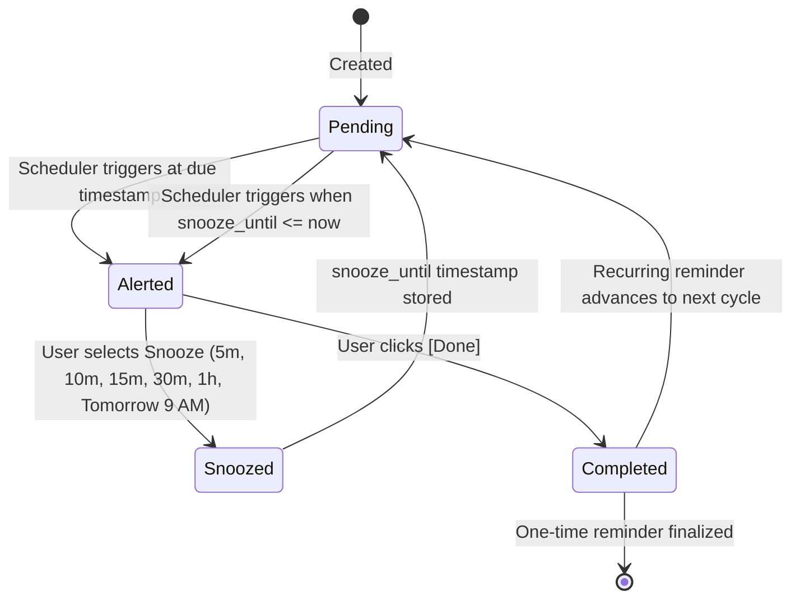

# Reminder Engine Specification

The Kisthenics reminder engine is responsible for accurate, low-latency, and battery-friendly reminder triggering across system reboots, time changes, and laptop sleep states.

All scheduling logic is authoritatively executed in native **Rust** within `src-tauri/src/lib.rs`.

---

## 1. Supported Recurrence Types

| Recurrence | Trigger Behavior | Calculation Logic |
| :--- | :--- | :--- |
| **`once`** | Triggers once at the specified date and time. | Marked `status = 'completed'` when completed. |
| **`daily`** | Recurs every 24 hours. | On completion, `date` advances by +1 day (`advance_date_by_days`), `trigger_timestamp` increases by `86_400_000 ms`, and `status` returns to `'pending'`. |
| **`weekly`** | Recurs every 7 days on the same weekday. | On completion, `date` advances by +7 days, `trigger_timestamp` increases by `7 * 86_400_000 ms`, and `status` resets to `'pending'`. |
| **`weekdays`** | Recurs Monday through Friday only. | On completion, `advance_date_next_weekday` skips Saturday and Sunday to find the next business day, updates timestamp accordingly, and returns to `'pending'`. |

---

## 2. Snooze & Completion Lifecycle



### Snooze Operation (`snooze_reminder`)
- Updates `snooze_until = now + (minutes * 60 * 1000)`.
- Increments `snooze_count = snooze_count + 1`.
- Resets `status = 'pending'`.
- Notifies scheduler condition variable immediately.

### Complete Operation (`complete_reminder`)
- For `once` reminders: sets `status = 'completed'` and records `completed_at = now`.
- For recurring reminders: advances the date and timestamp per recurrence rule, resets `snooze_until = NULL`, and sets `status = 'pending'`.

---

## 3. Startup Recovery & Reliability

1. **Recovery of Alerted Reminders**:
   If the computer is shut down while an alert window is active, uncompleted reminders remain in an `'alerted'` state. Upon next startup, `init_db` resets these to `'pending'` so they are never lost:
   ```sql
   UPDATE reminders SET status = 'pending' WHERE status = 'alerted' AND completed_at IS NULL;
   ```
2. **Clock Drift & Sleep/Wake Protection**:
   The native scheduler clamps sleep time to a maximum of 10 seconds. When a laptop wakes from 8 hours of sleep, the scheduler automatically awakens within milliseconds and dispatches any missed reminders.
3. **Database Integrity Auto-Heal**:
   Every database open runs `PRAGMA quick_check(1)`. If corruption is ever detected, the database is safely backed up with a timestamp prefix and a fresh database is created without crashing the application.

---

## 4. Emotional Character Auto-Selection

When creating a reminder with character mode set to `'auto'`, the keyword inference engine (`src/utils/characterRegistry.ts`) evaluates the combined `title` and `message` text against regex patterns to match the most emotionally fitting character:

| Keyword Categories | Matched Character | Emotion Profile |
| :--- | :--- | :--- |
| *workout*, *gym*, *pushup*, *pullup*, *training*, *kadinama*, *hard* | **Kadinama Irunga** | Hardcore Grit & Motivation |
| *meeting*, *zoom*, *call*, *interview*, *standup*, *urgent*, *now* | **Shocked** | High Alert & Immediacy |
| *water*, *hydrate*, *sleep*, *rest*, *break*, *stretch*, *breathe* | **Sleepy** | Gentle Self-Care |
| *late*, *deadline*, *asap*, *tax*, *overdue*, *finish*, *warning* | **Angry** | Anti-Procrastination Push |
| *love*, *family*, *mom*, *dad*, *birthday*, *anniversary*, *gift* | **Loving** | Warm Appreciation |
| *question*, *check*, *review*, *verify*, *inspect*, *why* | **Curious** | Thoughtful Follow-up |
| *focus*, *deep*, *code*, *write*, *study*, *quiet*, *stealth* | **Silent** | Distraction-Free Flow |
| *good*, *great*, *done*, *ship*, *cool*, *awesome* | **Cool Approval** | Positive Reinforcement |
| Default Fallback | **Thumbs Up** | Friendly Encouragement |
